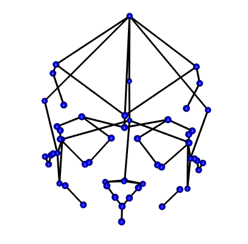
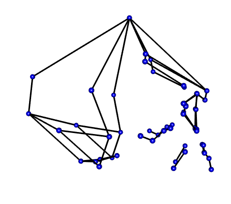

# Data Processing in R Workflow

## Purpose and Design

This page is a short overview of the SlicerMorph data and a walkthrough of how it was prepared for detailed analysis in r. It illustrates the processes of importing data, merging it with demographic qualifiers, and organizing it into an array that can be read and manipulated with the `geomorph` package. 

This markdown file utilizes codechunks
```{r, include=FALSE, cache=FALSE}
knitr::read_chunk('SLprocess2026.r')
```

Load needed packages

```{r, Loadpackages, message=FALSE, warning=FALSE}
library(rgl)
setupKnitr(autoprint = TRUE)
```

```{r,echo=FALSE}
library(skimr)
```

```{r,echo=FALSE}
library(rlang)
```

## Importing Data

The process for imported Slicer Data into a workable format in R was followed from the SlicerMorph/Tutorials page at `https://github.com/SlicerMorph/Tutorials/blob/main/GPA_3/parser_and_sample_R_analysis.md`. The instructions provided by this page were followed closely and adjusted if/when they did not provide the needed results. 

The primary file needed from the slicer export is the analysis.json file. This contains all of the 
objects generated by SlicerMorph's GPA Module. These objects are parsed by `parser2()` and stored in 
the SM.json list as individual objects. 

```{r, loaddata1}
```

From here, parse out the needed files from your analysis. You will need the `OutputData` and the `pcScores` for the following analysis

```{r, loaddata2}
```


## Merging Demographic data with Landmark data
Finally, I will want to correlate these files with the demographic data that I collected for each specimen. For this
I need to import the excel file that I generated to collect this data.
 
 - Be sure to check the file type. I was sure to save 
my excel file as a .csv

The SlicerMorph GPA module worked well to identify Procrustes Distances and develop PCAs but was not able to show where the sample variation came from. To highlight the significance of these results I developed an Excel spreadsheet with data on each individual's Age, Sex, and Ancestry. This data then needed to be imported into r and merged with the SM.output landmark data. 


```{r, merge1}
```
### Data Summary

I do a couple of things here to make sense of the data I just imported into r. The first thing I want to see
is an overview of my demographic distribution. 

*You can see a handfull of IND designations here.
This is not because the information is unavailable or otherwise difficult to obtain, I just didn't take note of it for all specimens because it is not entirely
relevant to my specific research.* 

I can thereafter configure and plot my data with the following code:


```{r, merge2}
```

#### Data Matrix
In addition to a summary of demographic data, we can take a quick look at our fully merged data matrix. This matrix includes
all of the landmark files, the demographic data, and the analytic data (procrustes distances and centroids). Since I don't
need to see the entire matrix (this would take up a lot of space on this page), I will limit the summary to just the first 6 rows.


The following tables thus illustrate the first 6 rows of the merged data. The three tables displayed here include:

 - Data Summary
 - Variable type: factor
 - Variable type: numeric


This table depicts an overview of what type of data is stored and how many unique components there are. For this analysis there
are shown to be 35 rows and 6 columns. 4 of the rows are classified as factors while the remain 2 are classified as numeric values.

```{r, merge3}
```

## Build array from Slicer data

To work with coordinate data in r, `geomorph` requires that the information be formatted into an array 
by using `arrayspecs`. 

```{r, BuildingArray}
```


```{r, Array}
```

To visualize the coordinate data (see below) I took the mean shape from the landmarks and plotted them to 
build a wire fram using `d1Links <- define.links(Mshape.Coords, ptsize = 7, links = NULL)`. This is the 
code needed to initiate the construction of a wireframe. This code is not saved in my `data_processing.r` 
script. If in the code script, the analysis will pause and wait for the construction of a new wireframe each 
time it is run. Instead I ran the code once and saved the resulting data as a spreadsheet `d1Links.csv`. 
This file can be found in the `Data` folder. 

*This functionality has since become obsolete. Geomorph dropped the define.links function due to 
compatability problems in the 3D viewer. This aspect of my 
workflow is not important. I used it because I like the visualization. 
I can maybe come back to it in the future (there is a way to manually do it)
but for now it is not important.* 

:::{#fig layout-ncol=2}

   
   
   
   
   Wireframe from Coordinates
:::

## The next steps in this project can be found on the [`Analysis`](R_Analysis.qmd) page. 